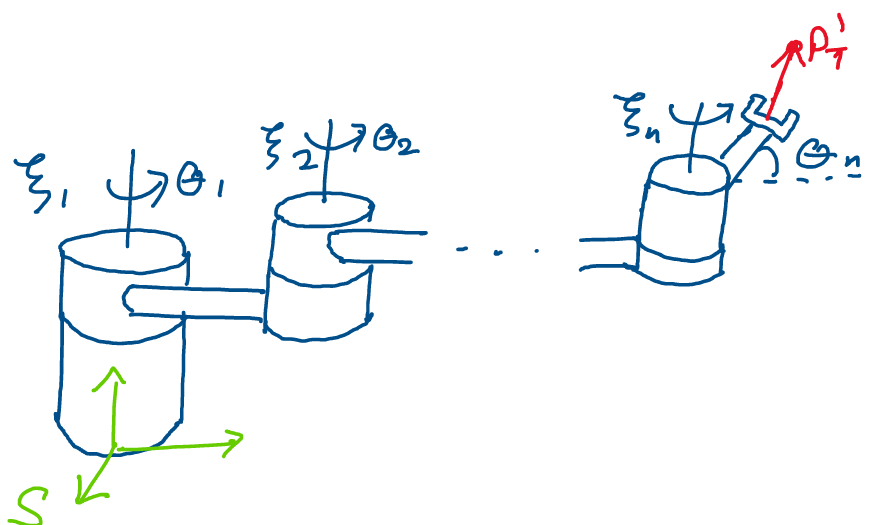

# Forward Kinematics

Welcome back! So far, we've developed a *monumental* amount of theory
regarding the motion of rigid bodies. We've developed strong
representations of rotations and general rigid body transformations, and
have devised numerous convenient parameterizations for both.\
In this section, we'll *finally* be able to begin to appreciate the
significance of our developments, and will apply them to finding the
rigid body transformations associated with real-world robots.\
In studying something called the *forward kinematics* of robots, we'll
truly be able to enjoy the power of twists, screws, and exponential
coordinates, and see that our struggle has allowed us to come up with a
truly elegant representation of complex robot motions. Let's get
started!

## Robot Joints

As real world robots are composed of many complex joints, having an
understanding of the motion of each individual joint of a robot arm is a
good first step in developing models of complex robot motion. In this
section, we'll define three fundamental robot joints, and see how we may
apply twists and screws to describe their motion.\
The first fundamental robot joint is the **prismatic joint**. This is a
joint that corresponds to a pure translational motion. Consider the
robot arm below, for example:

\
*Above: a prismatic robot joint is a joint that undergoes pure
translation*

We see that this arm is *only* able to move along a single axis in
space - in this case the y-axis of the frame. Since this is a pure
translational motion, we know that this robot arm has a prismatic
joint.\
How can we find the twist associated with this joint? We recall that for
every purely translational motion, we may find a twist of the form:

$$\begin{aligned}
    \xi_{prismatic} = 
    \begin{bmatrix}
    v\\
    0
    \end{bmatrix}
\end{aligned}$$ 

Where $v \in \mathbb{R}^3$ is a unit vector pointing in
the direction of translation. To describe the transformation of
translating in direction $v$ by $\theta$ units of distance, we recall
that we may use the matrix exponential of the hat map of this twist:

$$\begin{aligned}
    g_{translational} = e^{\hat\xi_{prismatic}\theta} \in SE(3)
\end{aligned}$$ 

The next, and perhaps most common, type of robot joint
is the **revolute joint**. This is a joint that purely rotates about
some axis in space. Consider the following example of a revolute joint,
pictured in red:

\
*Above: a revolute joint undergoes pure rotation*

In the image above, the red joint of the robot arm only undergoes a pure
rotation about an axis in space, which is drawn here as a dotted green
line. Because this joint undergoes a pure rotation about an axis, we say
that it is a *revolute joint*.\
Since revolute joints undergo pure rotations, we may describe the motion
of a revolute joint with a twist corresponding to a pure rotational
motion. Recall that we may express the twist of a purely rotational
motion as: 

$$\begin{aligned}
    \xi_{revolute} = 
    \begin{bmatrix}
        -\omega \times q\\
        \omega
    \end{bmatrix}
\end{aligned}$$ 

Where $\omega$ is the unit vector axis of rotation and
$q$ is any point on the axis of rotation, expressed in the spatial
frame.\
To find the rigid body transformation associated with rotating a
revolute joint by $\theta$ radians about its axis, we may take the
matrix exponential of its twist: 

$$\begin{aligned}
    g_{revolute} = e^{\hat\xi_{revolute}\theta} \in SE(3)
\end{aligned}$$

As a brief aside, note that a convention when drawing
robot arms is to draw a set of slanted dashed lines wherever the robot
is securely attached to its environment. In the picture above, for
example, the slanted dashed lines drawn on the joint in blue indicate
that the robot is fixed in space, perhaps to the ground or a wall, at
that point.\
The final important class of joint we'll discuss is the **screw joint**.
Recall that previously, we defined screw *motion* to be a motion
involving a rotation about an axis and a translation parallel to that
axis.\
The definition of screw motion leads naturally to the definition of a
screw joint! A screw joint is a joint of a robot arm that involves a
rotation and translation about the same axis. Consider the following
example of a screw joint:

\
*Above: a screw joint corresponds to a rotation and a translation of a
robot link about the same axis*

In the example above, when the robot joint rotates about its axis, it
also translates along the axis. As with screw motion, we may compare the
motion of these joints to the motion of nuts and bolts! When we turn a
nut on a bolt, it both spins on and translates along the axis of the
bolt.\
Because the motion of a screw joint involves a rotation about an axis
and a translation along that axis - the same set of motions as a screw
motion - we may use the twist of a rotational screw motion to represent
the motion of a screw joint.\
We therefore write the twist of a screw joint as: 

$$\begin{aligned}
    \xi_{screw} = 
    \begin{bmatrix}
        -\omega \times q + h\omega\\
        \omega
    \end{bmatrix}
\end{aligned}$$ 

Where $\omega$ is the unit vector pointing along the
axis of rotation, $q$ is any point on the axis of rotation, and $h$ is
the pitch, the ratio of translational to rotational motion. Recall that
$-\omega \times q$ comes from the rotational part of the screw motion,
while $h\omega$ comes from the translational part of the screw motion.\
To represent the rotational, translational motion of a screw joint, we
may once again apply the matrix exponential to the twist:

$$\begin{aligned}
    g_{screw} = e^{\hat\xi_{screw} \theta} \in SE(3)
\end{aligned}$$

Where $\theta$ is the amount of rotation about the screw
axis.\
Now that we have these three fundamental robot joints and their
associated rigid body transformations, we can construct larger and more
complex robot arms by attaching these joints to each other! Consider the
complex robot arm below, for example:

\
*Above: a complex robot arm composed of the three fundamental joints*

Which joints can we identify in the robot arm above? We see that the
first joint is a screw joint, as it involves both a rotation and a
translation along a screw axis. The second joint is a revolute joint, as
the red piece of the robot arm only undergoes pure rotation. The third
joint is a prismatic joint, as it simply moves up and down with respect
to its previous joint.\
We refer to each of these independent segments in a robot arm as a
**robot link**. Note that we assume each link is a rigid body - this
will allow us to apply the theory of rigid body transformations to the
motion of complex robot arms.

## Describing Robot Configurations

Once we begin forming more complex manipulator arms composed of multiple
joints, it becomes more and more challenging to keep track of the
possible configurations of the robot. For example, if we have a robot
arm with six independent joints, changing any one of the six joint
positions will give an entirely new robot configuration!\
In this section, we'll develop a precise mathematical framework for
describing the set of *all* of possible positions for a robot arm. This
set will provide us with a convenient way of assessing where a robot arm
is capable of moving.\
We'll begin this process with a precise definition of the space of robot
arm configurations.

```{prf:definition}
:label: joint_space
**Joint Space**\
The joint space of a robot arm is the set $Q$ of all possible joint
angle or position combinations for the manipulator arm.

$$\begin{aligned}
    Q = \{\text{All Joint Configurations}\}
\end{aligned}$$
```

How may we describe this set in more mathematical terms? Let's take a
moment to think about the sets of possible joint positions and angles
for the types of joints we discussed in the previous section.\
Consider the following top-down view of a revolute joint. We know that
we may represent the position of the joint using an angle $\theta$, the
displacement of the joint relative to its starting position.

\
*Above: the configuration of a revolute joint changes depending on the
angle $\theta$. The end effector traces out a circle as $\theta$
varies.*

How can we describe the set of all possible angles of the revolute
joint? Let's think about the conditions the angle $\theta$ is subject
to.\
We know that at the very least, $\theta$ will always be a real number.
Can we be any more specific about the set of possible $\theta$ values?
Since $\theta$ refers to the angle of *rotation* of a joint, we know
that after $\theta = 2\pi$, the configurations will begin to repeat
themselves!\
Because of this, the set of all possible configurations of a revolute
joint may be described by an angle $\theta$ between 0 and $2\pi$, since
after $2\pi$, the joint will be back where it started.\
We name the set of possible $\theta$ values for a revolute joint
$\mathbb{S}^1$, where $\mathbb{S}$ refers to the circular nature of the
set[^1] and $1$ refers to the number of angles we need to describe our
position on the circle.[^2]\
Mathematically, the set $\mathbb{S}^1$ may be be identified by the
interval $\theta \in [0, 2\pi)$, where we don't include the second
endpoint to avoid repeating angular configuations.\
Let's now think about the set of all possible values for the position of
a prismatic joint. We know that a prismatic joint is a joint that is
able to translate along a fixed direction in space. Because this
direction is fixed for every prismatic joint, all we need to describe
the position of a prismatic joint is the distance we've moved along that
direction, which is a real number in $\mathbb{R}$.

\
*Above: the position of a prismatic joint may be any real number*

Is it possible to get any more specific than this set for a prismatic
joint? Let's think about it in a way similar to the case of a revolute
joint.\
We know that a prismatic joint involves a translation along a single
direction $v$. If we keep moving along $v$ in one direction, is there
any way we'll end up back where we started like we did in the revolute
case?

\
*Above: by translating along a single direction $v$, is there any way we
can get back to where we started?*

As we can see in the image above, if we move along a single direction in
space, there's no way we'll ever end up back at our starting position!\
This means that there is no "periodic behavior\" in the position of a
prismatic joint, unlike in the case of a revolute joint. Because of
this, we conclude that we must use the entire set of real numbers,
$\mathbb{R}$, to represent the set of all positions of a prismatic
joint.\
With the sets $\mathbb{S}^1$ and $\mathbb{R}$, we're now ready to
describe the set of all possible positions for any individual robot
joint. What we still need, however, is a way to mathematically write the
set of all combinations of elements of these sets. This comes in the
form of the Cartesian product.[^3]

```{prf:definition}
:label: cart_prod
**Cartesian Product**\
The Cartesian product of two sets $A = \{A_1, A_2, ..., A_n\}$ and
$B = \{B_1, B_2, ..., B_m\}$, written $A\times B$, is the set of all
combinations of elements of $A$ and $B$. 

$$\begin{aligned}
    A\times B = \{(A_1, B_1), (A_1, B_2), ..., (A_2, B_1), (A_2, B_2), ... (A_n, B_m)\}
\end{aligned}$$
```

We may use this Cartesian product as a tool to write out the set of all
possible joint configurations of our robots - after all, each robot
configuration is just one combination of joint positions!\
As a demonstration of how the Cartesian product is used, we'll write out
an expression for the joint space, $Q$, of the following robot arm:


Let's first identify the types of joints in this arm. The first joint is
revolute, the second joint is revolute, and the third joint is
prismatic, as it is a purely translational joint.\
Now, we want to write an expression for the joint space $Q$ - the set of
*all* possible joint configurations of this robot. We know that this is
the set of all possible *combinations* of the three joints above.\
Since the first two joints are revolute, we know that the first and
second joints may be described by $\mathbb{S}^1$. Since the third joint
is prismatic, the set of all possible positions of the third joint is
$\mathbb{R}$.\
Since the joint space is the set of all *combinations* of joint
positions and we know the sets corresponding to each joint, we may
express $Q$ as: 

$$\begin{aligned}
    Q = \mathbb{S}^1\times \mathbb{S}^1 \times \mathbb{R}
\end{aligned}$$ 

Thus, using the Cartesian product to express the set of
combinations, we've identified the set of *all* possible joint positions
for the robot.\
What does a single element of this joint space, $\theta \in Q$, actually
look like? Let's rewrite the joint space of the robot above in
traditional set-builder notation to gain some perspective.

$$\begin{aligned}
    Q = \mathbb{S}^1\times \mathbb{S}^1 \times \mathbb{R}
    = \{(\theta_1, \theta_2, \theta_3) \; | \; \theta_1, \theta_2 \in \mathbb{S}^1, \theta_3 \in \mathbb{R} \}
\end{aligned}$$ 

We see that each element of the joint space of this
robot, $\theta \in Q$, is actually list of the three joint positions!
Because of this, we often express the configuration of a robot as a
vector of the robot's joint positions. For the robot above, for example,
we could express its joint positions as the vector: 

$$\begin{aligned}
    \theta = \begin{bmatrix}
    \theta_1\\
    \theta_2\\
    \theta_3
    \end{bmatrix}
\end{aligned}$$ 

Where $\theta_1$ refers to the position of the first
joint, $\theta_2$ the position of the second joint, and $\theta_3$ the
position of the third joint. This is a common convention that we'll use
going forwards.\
Let's zoom out for a moment, and take a higher level overview of our
analysis of the joint space of this robot. Are there any patterns we can
extract from our final expression?\
We found that when we had two revolute joints and a single prismatic
joint, we had two appearances of $\mathbb{S}^1$ in our Cartesian product
and one appearance of $\mathbb{R}$. It turns out that this pattern of
the number of $\mathbb{S}^1$s and $\mathbb{R}$s in the Cartesian product
matching the number of revolute and prismatic joints will generalize to
robots composed of arbitrary numbers of revolute and prismatic joints.\
If we have a robot with $n$ revolute joints and $m$ prismatic joints,
the joint space of the robot may be expressed: 

$$\begin{aligned}
    Q = \mathbb{S}^1 \times \mathbb{S}^1 \times ... \times \mathbb{S}^1 \times \mathbb{R} \times \mathbb{R} \times  ... \times \mathbb{R} 
\end{aligned}$$ 

Where we have $n$ appearances of $\mathbb{S}^1$ and $m$
appearances of $\mathbb{R}$.\
It's important to note that the order in which we write the sets in a
Cartesian product has *no effect* on the final resulting set! This is
because the Cartesian product is simply all of the possible combinations
of each set, and thus *doesn't* depend on the order in which we write
the sets.\
Outside of joint space, are there any other high level descriptions of a
robot that provide us with some useful information about our system? A
common piece of information about a robot arm is its *degrees of
freedom*, which we define below.

```{prf:definition}
:label: dof
**Degrees of Freedom**\
The degrees of freedom (DOF) of a robot arm are the number of joints in
the robot which we may independently move.
```

Let's try to find the number of degrees of freedom of the arm below,
which has a screw joint followed by a revolute joint followed by a
prismatic joint.


Let's consider the first joint, the screw - how many degrees of freedom
does this joint add to the system? We know that this joint introduces
both a rotation and a translation into the system. However, we know that
the rotation and translation *aren't* independent motions!\
When we rotate a screw joint by some amount, we know that the pitch of
the screw will give us the corresponding translation: 

$$\begin{aligned}
    d = h\theta
\end{aligned}$$ 

Where $d$ is the distance the joint translates, $h$ is
the screw pitch, and $\theta$ is the angle the joint rotates. Because of
this relationship between rotation and translation, we may only control
one parameter at a time in a screw joint. Thus, the screw joint adds
only one degree of freedom to the system.\
Next, we consider the revolute joint. Here, we only have one parameter
we can control - the angle of rotation about the axis. What's more, we
may change this rotation totally independently of the other parameters
in the robot! The revolute joint therefore adds one more degree of
freedom.\
Finally, we consider the prismatic joint. We're able to move the
prismatic joint up and down to any position we want. Does our ability to
move this joint depend on any of the others? Since we can control the
prismatic arm entirely independently from the other joints in the robot,
we conclude that the prismatic joint also adds a degree of freedom.\
Adding up each degree of freedom, we conclude that this robot arm has
three total degrees of freedom.

## The Product of Exponentials

Now that we have an understanding of the different joints and the
possible configurations of a robot arm, we can tackle the practical
problem of describing robot arm motion. Solving this problem will allow
us to gain a *complete* description of the motion of our robot arm using
*just* the angles.

\
*Above: how can we find the transformation between frames $S$ and $T$
for arbitrary joint angles?*

Let's hone in on exactly what it is that we want. Given *any* choice of
joint angles $\theta = (\theta_1, \theta_2, ...,\theta_n)$, we want to
be able to figure out the rigid body transformation between two key
frames on a robot: the tool frame $T$ and the spatial frame $S$.\
The tool frame is a frame that moves with the robot, and is rigidly
attached to the end of the final joint of the robot, a position known as
the *end effector*. Whenever we rotate and translate the final joint of
the robot, the tool frame rotates and translates with it. You can think
of the tool frame as the frame attached to the gripper on the end of the
Sawyer robots in the lab.\
The spatial frame, on the other hand, is a frame *fixed* in space to the
base of the robot. You can think of this as a reference frame attached
to the base of your Sawyer robot. This frame *never* moves, even as the
robot arm rotates and translates in space.\
We'd now like to find the following rigid body transformation matrix for
a robot with a joint space $Q$: 

$$\begin{aligned}
    g_{st}(\theta) \in SE(3), \; \theta \in Q
\end{aligned}$$ 

Where $g_{st}(\theta)$ is the rigid body transformation
between the spatial and tool frames of the robot for *any* joint
configuration $\theta = (\theta_1, \theta_2, ..., \theta_n) \in Q$.

\
*Above: how can we find the transformation between $S$ and $T$ for *any*
robot configuration?*

Because $g_st(\theta)$ is a rigid body transformation that depends on
the positions of all of the joints, it is a function that maps from the
joint space of the robot to the set of rigid body transformations. We
may express this mathematically as: 

$$\begin{aligned}
    g_{st}(\theta): Q \to SE(3)
\end{aligned}$$ 

Where $\theta = (\theta_1, \theta_2, ..., \theta_n) \in Q$ is a vector
containing all of the joint positions of the robot. This map from the
joint angles of a robot to the rigid body transformation between its
spatial and tool frames is called the **forward kinematics map**.\
How can we find this forward kinematics map in a convenient way? One
valid method is to start at the tool frame, put a reference frame on
each joint of the robot, and transform from joint to joint until we
reach the spatial frame. However, since each joint has an *arbitrary*
position $\theta_i$, this is something that will be challenging to write
out!\
We'll find that this problem is *greatly* simplified by using
exponential coordinates and screw motions. Let's begin developing the
mathematics of this approach!\
To do this, we'll start with a very general template for what a robot
arm is - this way, our resulting formula will apply to *any* robot arm.
Imagine we have a robot with *n* arbitrary joints. Each joint may be
either a revolute, prismatic, or screw joint.

\
*Above: an arbitrary robot with $n$ joints. Note that the \... refers to
the remaining joints of the robot between the three that have been
drawn.*

Recall that our goal is to find the transformation $g_{st}(\theta)$ from
the base frame $S$ of the robot to the tool frame $T$ as a function of
each of the joint angles $(\theta_1, ..., \theta_n)$. Where should we
begin our search for this transformation?\
First, let's think about what this transformation will do. If we apply
$g_{st}$ to a point $p_t$ in the tool frame, we will get back $p_s$, the
point as seen from the spatial frame. This fact comes from the
definition of a rigid body transformation.

\
*Above: by applying $g_{st}$ to a point $p_t$ in the tool frame, we will
get $p_s$, its representation in the spatial frame.*

Let's see if we can compute the representation of $p_t$ in the spatial
frame using exponential coordinates! We may begin by transforming the
point $p_t$ from frame $T$ into frame $S$ in the *reference
configuration*. This is the configuration where each joint position is
zero and the robot *hasn't* yet moved.\
We may accomplish this transformation using the matrix:

$$\begin{aligned}
    g_{st}(0) = 
    \begin{bmatrix}
    R_{st}(0) & p_{st}(0)\\
    0 & 1
    \end{bmatrix} \in SE(3)
\end{aligned}$$ 

Where $R_{st}(0)$ is the rotation matrix between frames
$S$ and $T$ in the reference configuration and $p_{st}(0)$ is the
translation between the frames. Note that since the robot hasn't yet
moved, this matrix is relatively simple to find.\
Once we have this transformation, we apply it to point $p_t$ to
transform it into the spatial frame: 

$$\begin{aligned}
    p_s(\theta_1 = 0, \theta_2 = 0, ..., \theta_n = 0) = g_{st}(0)p_t
\end{aligned}$$ 

This takes the point $p_t$ from the tool frame into the
spatial frame. Now that we have this point in the spatial frame, we're
ready to begin moving the joints of the robot! Let's look at what
happens to this point when we move the furthest out joint, joint $n$, by
amount $\theta_n$.

\
*Above: moving joint $n$ by amount $\theta_n$*

Since joint $n$ is one of the three fundamental joints, we know from our
development of robot joints that we may represent its motion using a
twist $\xi_n$ and a scalar $\theta_n$. If we solve for the twist of
joint $n$ in the spatial frame, the transformation: 

$$\begin{aligned}
    g_n = e^{\hat\xi_n\theta_n}
\end{aligned}$$ 

Will transform points by the motion of joint $n$ in the
spatial frame. Thus, to find the position of point $p_t$ in the spatial
frame after moving joint $n$ to position $\theta_n$, we may compute:

$$\begin{aligned}
    p_s(\theta_1 = 0, \theta_2 = 0, ..., \theta_n = \theta_n) = e^{\hat\xi_n\theta_n}g_{st}(0) p_t
\end{aligned}$$ 

Where $g_{st}(0)$ first transforms $p_t$ into the
spatial frame and $exp(\hat\xi_n\theta_n)$ moves $p_t$ in the spatial
frame according to the motion of joint $n$.\
Now that we've found the point in the spatial frame after moving joint
$n$, we may do the same for the next joint, $n-1$. We know that there is
some twist $\xi_{n-1}$ in the spatial frame and some scalar
$\theta_{n-1}$ corresponding to the motion of joint $n-1$.\
What do we know about the value of this twist? Since we started out by
moving the furthest-out joint, joint $n$, all of the other joints
further in weren't affected at all by the motion of joint $n$!\
This means that when computing the twist of joint $n-1$, the twist will
*not* be affected by moving joint $n$, and will therefore be same as it
is in the reference configuration. Since we don't have to account for
the motion of joint $n$, this makes $\xi_{n-1}$ just as easy to
calculate as $\xi_n$. This is why we start our calculation by moving the
furthest-out joint.

\
*Above: After moving joint $n$, the rest of the joints are all still in
the same position. This allows us to calculate all of the twists using
the reference configuration joint positions.*

After moving joints $n$ and $n-1$, we compute the position of $p_t$ in
the spatial frame as: 

$$\begin{aligned}
    p_s(\theta_1 = 0, \theta_2 = 0, ..., \theta_{n-1} = \theta_{n-1}, \theta_n = \theta_n) = e^{(\hat\xi_{n-1}\theta_{n-1})}e^{(\hat\xi_n \theta_n)}g_{st}(0)p_t
\end{aligned}$$ 

Where $g_{st}(0)$ converts $p_t$ to the spatial frame,
$exp(\hat\xi_n\theta_n)$ moves the point according to the motion of
joint $n$, and $exp(\hat\xi_{n-1}\theta_{n-1})$ moves the point
according to the motion of joint $n-1$.\
We may repeat this process of finding a twist corresponding to the
motion of a joint and finding the exponential of that twist for the
remaining $n-2$ joints in the robot! To avoid the problem of inner joint
motions affecting the positions of outer joints, we continue to apply
these transformations from the outside in.\
After finding all of the transformations, we find that the final
position of point $p_t$ in the spatial frame after moving all $n$ robot
joints is: 

$$\begin{aligned}
    p_s = e^{\hat\xi_1\theta_1}e^{\hat\xi_2\theta_2}\cdot\cdot\cdot e^{\hat\xi_n\theta_n}g_{st}(0)p_t
\end{aligned}$$ 

Where each of the twists is computed with respect to its
reference position due to the order of multiplication.\
What does this total calculation give us? Since we start by transforming
point $p_t$ into the spatial frame in the reference configuration, and
then proceed to transform it in the spatial frame according to the
motion of each joint, we know that the result is $p_s$! This is the
point $p_t$ in the spatial frame, where the joints of the robot are in
configuration $\theta = (\theta_1, \theta_2, ..., \theta_n)\in Q$.\
Thus, the product of all of these transformations has provided us with a
map between a point in the tool frame $T$ and its representation in the
spatial frame $S$ after moving the robot to an arbitrary configuration.\
This is *exactly* the map that we were looking for! Thus, we conclude
that we may compute $g_{st}(\theta) \in SE(3)$ for an arbitrary
configuration $\theta \in Q$ as: 

$$\begin{aligned}
    g_{st}(\theta) = e^{\hat\xi_1\theta_1}e^{\hat\xi_2\theta_2}\cdot\cdot\cdot e^{\hat\xi_n\theta_n}g_{st}(0)
\end{aligned}$$ 

Where $\xi_i$ is the twist in the spatial frame
associated with the $i^{th}$ joint, $\theta_i$ is the position of the
$i^{th}$ joint, and $g_{st}(0)\in SE(3)$ is the transformation between
$S$ and $T$ in the case where no joints have been moved. This
transformation formula is called the **product of exponentials**
formula.\
Let's summarize what we've just done. In this section, our goal was to
find some way of getting from an arbitrary set of joint angles for any
robot, $\theta = (\theta_1, \theta_2, ..., \theta_n) \in Q$, to a rigid
body transformation $g_{st}(\theta)$ between the spatial frame at the
base of the robot and the end effector frame on the end of the robot. We
found that we were able to accomplish this in an elegant manner using
the product of exponentials formula.\
Let's do an example to gain a feel for what it's like to use the product
of exponentials formula in practice.\
**Example:** *Find the forward kinematics map between the spatial and
tool frames for the following robot manipulator arm, which is depicted
below in the reference configuration.*


*The lengths of the first and second links are $l_1$ and $l_2$
respectively, and the $z$ position of frame $T$ in the reference
configuration is $l_0$.*\
\
In this problem, we're asked to find the forward kinematics map of a
robot arm. Remember, this is just the transformation $g_{st}(\theta)$
between the spatial and tool frames of the robot. Let's get started!\
First, to understand what we need to find, we'll lay out the product of
exponentials formula for this robot. Since the robot has three joints,
we know we may use the following product of exponentials formula to find
$g_{st}(\theta)$: 

$$\begin{aligned}
    g_{st}(\theta) = e^{\hat\xi_1\theta_1}e^{\hat\xi_2\theta_2}e^{\hat\xi_3\theta_3}g_{st}(0)
\end{aligned}$$ 

Where $\xi_1$, $\xi_2$, and $\xi_3$ are the twists
associated with the first, second, and third joints of the robot. To
find the forward kinematics map, we simply need to fill in the terms in
this product of exponentials equation!\
We may begin by finding $g_{st}(0)$, the transformation between the
spatial and tool frames in the reference configuration. Since this
matrix is a rigid body transformation in $SE(3)$, it will have the
following form: 

$$\begin{aligned}
    g_{st}(0) = 
    \begin{bmatrix}
        R_{st}(0) & p_{st}(0) \\
        0 & 1
    \end{bmatrix}
\end{aligned}$$ 

First, let's solve for the the rotation matrix
$R_{st}(0)$. Referring to the drawing provided, we know that the frames
appear as follows:


When we take a close look at these two frames, we notice that even
though we haven't yet moved any joints, the tool frame has a naturally
different orientation to the spatial frame! This means that $R_{st}(0)$
is *not* the identity matrix!\
We may find the columns of $R_{st}(0)$ by looking at how the basis
vectors of frame $T$ appear from frame $S$. 

$$\begin{aligned}
    R_{st}(0) = \begin{bmatrix}
        [x_t]_s & [y_t]_s & [z_t]_s
    \end{bmatrix}
    = 
    \begin{bmatrix}
        0 & 0 & 1\\
        1 & 0 & 0\\
        0 & 1 & 0
    \end{bmatrix}
\end{aligned}$$ 

Perfect! Now, we solve for $p_{st}(0)$, the vector in
the spatial frame pointing from the origin of frame $S$ to the origin of
frame $T$ in the reference configuration. We see from the drawing that
in the reference configuration, frame $T$ is shifted over by $l_1 + l_2$
in the y-direction of the spatial frame, and is shifted up by $l_0$ in
the z-direction of the spatial frame.\
Thus, we compute the total translation vector by summing these two
translations: 

$$\begin{aligned}
    p_{st}(0) = \begin{bmatrix}
        0\\
        l_1 + l_2\\
        0
    \end{bmatrix}
    + 
    \begin{bmatrix}
        0\\
        0\\
        l_0
    \end{bmatrix}
     = \begin{bmatrix}
         0\\
         l_1 + l_2\\
         l_0
     \end{bmatrix}
\end{aligned}$$ 

Putting this together with the rotation matrix, we find
the rigid body transformation between $S$ and $T$ in the reference
configuration: 

$$\begin{aligned}
    g_{st}(0) = 
    \begin{bmatrix}
        0 & 0 & 1 & 0\\
        1 & 0 & 0 & l_1 + l_2\\
        0 & 1 & 0 & l_0\\
        0 & 0 & 0 & 1
    \end{bmatrix}
\end{aligned}$$ 

Great! Referring to the product of exponentials formula,
we see that all that remains is to compute the twists for each joint.
Let's start with the first joint.


We notice that this is a *revolute* joint, as moving this joint gives a
purely rotational motion. Using our developments from earlier, we know
that the twist of a revolute joint is of the form: 

$$\begin{aligned}
    \xi = 
    \begin{bmatrix}
        -\omega \times q\\
        \omega
    \end{bmatrix}
\end{aligned}$$ 

Where $\omega$ is the unit vector axis of rotation and
$q$ is any point on the axis in the spatial frame. Looking at the
diagram, we notice that a movement of joint 1 will correspond to a
rotation about the z-axis in the spatial frame! Thus: 

$$\begin{aligned}
    \omega = \begin{bmatrix}
        0\\
        0\\
        1
    \end{bmatrix}
\end{aligned}$$ 

Now, all we need to complete the twist is a point on
this axis in the spatial frame. Recall that since the product of
exponentials formula goes from the outside-in, this point should be on
the position of the axis in its reference configuration.\
Looking at the diagram, we notice that this axis of rotation passes
*straight* through the origin! Thus, we may choose the point
$q = [0, 0, 0]^T$ as the point on our axis of rotation. Calculating
$-\omega \times q$, we find: 

$$\begin{aligned}
    -\omega \times q = 
    -\begin{bmatrix}
        0\\
        0\\
        1
    \end{bmatrix}
    \times 
    \begin{bmatrix}
        0\\
        0\\
        0
    \end{bmatrix}
     = 
     \begin{bmatrix}
        0\\
        0\\
        0
    \end{bmatrix}
\end{aligned}$$ 

It's important to note that by choosing a convenient
point on our axis of rotation, such as $[0, 0, 0]$, we can *greatly*
simplify the calculations we need to do.\
Using these vectors, we know that the twist of the first joint is:

$$\begin{aligned}
    \xi_1 = 
    \begin{bmatrix}
       -\omega \times q\\
       \omega
    \end{bmatrix}
    = 
    \begin{bmatrix}
       0\\
       0\\
       0\\
       0\\
       0\\
       1
    \end{bmatrix}
\end{aligned}$$ 

Next, we'll solve for $\xi_2$, the twist of the second
joint. Looking at the drawing of the robot:


We observe that the second joint is also revolute! It will therefore
also have a twist of the form: 

$$\begin{aligned}
    \xi_2 = 
    \begin{bmatrix}
       -\omega \times q\\
       \omega
    \end{bmatrix}
\end{aligned}$$ 

Looking at the picture, we observe that the axis of
rotation is the positive z axis: 

$$\begin{aligned}
    \omega = 
    \begin{bmatrix}
       0\\
       0\\
       1
    \end{bmatrix}
\end{aligned}$$ 

Now, we must find a point $q$ in the spatial frame on
this axis of rotation. Once again, remember that the order
multiplication in the product of exponentials formula means that we
*don't* have to account for the motion of joint 1 when finding this
point! All we have to do is pick a point on the axis in the reference
configuration.\
Since the second joint is positioned at $l_2$ along the y-axis of the
spatial frame, its axis of rotation doesn't pass through the origin of
the spatial frame! Thus, for this joint, we instead choose the following
point on the axis of rotation: 

$$\begin{aligned}
    q = 
    \begin{bmatrix}
        0\\
        l_1\\
        0
    \end{bmatrix}
\end{aligned}$$ 

Now, we compute $-\omega \times q$ to complete our
calculation of the twist: 

$$\begin{aligned}
    -\omega \times q = 
    \begin{bmatrix}
       0\\
       0\\
       1
    \end{bmatrix}
    \times 
    \begin{bmatrix}
        0\\
        l_1\\
        0
    \end{bmatrix}
    = 
    \begin{bmatrix}
       l_1\\
       0\\
       0
    \end{bmatrix}
\end{aligned}$$ 

Remember to account for the negative sign when
completing this calculation!\
Using $\omega$ and $-\omega\times q$, we find that the second twist is:

$$\begin{aligned}
    \xi_2 = 
    \begin{bmatrix}
    l_1\\
    0\\
    0\\
    0\\
    0\\
    1
    \end{bmatrix}
\end{aligned}$$

This completes the calculations for the second joint.
Now, we turn our attention to the third joint:


We see from the drawing that the third joint is *prismatic*, as it
consists of a pure translation in the negative z direction. We know that
the twist of a prismatic joint is of the form: 

$$\begin{aligned}
    \xi = 
    \begin{bmatrix}
    v\\
    0
    \end{bmatrix}
\end{aligned}$$ 

Where $v$ is a unit vector pointing in the direction of
translation. Here, the direction of translation points in the negative z
direction in the spatial frame. Thus, we find that $\xi_3$ may be
computed: 

$$\begin{aligned}
    \xi_3 = 
    \begin{bmatrix}
    0\\
    0\\
    -1\\
    0\\
    0\\
    0
    \end{bmatrix}
\end{aligned}$$ 

Now that we've solved for $g_{st}(0)$ and the twists for
each joint, we have *all* we need to fill in the product of exponentials
formula! Using the three twists and initial transformation, we compute
the forward kinematics map between $S$ and $T$ as: 

$$\begin{aligned}
    g_{st}(\theta) = e^{\hat\xi_1\theta_1}e^{\hat\xi_2\theta_2}e^{\hat\xi_3\theta_3}g_{st}(0)
\end{aligned}$$ 

Where: 

$$\begin{aligned}
    \xi_1 = \begin{bmatrix}
       0\\
       0\\
       0\\
       0\\
       0\\
       1
    \end{bmatrix}&, \; 
    \xi_2 = \begin{bmatrix}
    l_1\\
    0\\
    0\\
    0\\
    0\\
    1
    \end{bmatrix}, \; 
    \xi_3 = \begin{bmatrix}
    0\\
    0\\
    -1\\
    0\\
    0\\
    0
    \end{bmatrix}\\
    g_{st}(0) &= \begin{bmatrix}
        0 & 0 & 1 & 0\\
        1 & 0 & 0 & l_1 + l_2\\
        0 & 1 & 0 & l_0\\
        0 & 0 & 0 & 1
    \end{bmatrix}
\end{aligned}$$ 

Note that if desired, the actual final matrix value for
$g_{st}(\theta)$ may be computed by multiplying the closed-form
expressions for the exponentials of twists. This completes the problem!

[^1]: The letter $\mathbb{S}$ comes from a convention of mathematical
    topology, where a 2D circle is referred to as a "1-sphere.\"
    Interestingly, the set of quaternions of unit magnitude may be
    identified by $\mathbb{S}^3$, the three-sphere.

[^2]: Note that the $1$ in $\mathbb{S}^1$ *doesn't* refer to an
    exponent, but rather the number of parameters we need to identify
    our position on the circle. Since for a 2D circle, we only need one
    angle to find our position, we describe a position on a 2D circle
    using the set $\mathbb{S}^1$.

[^3]: Although the symbol $\times$ is the same, the Cartesian product is
    *not* the same thing as the vector cross product. As a rule of
    thumb, when you see $\times$ applied to sets, think of the Cartesian
    product, while when you see $\times$ applied to vectors, think of
    the cross product.
