# Screw Motion

Welcome back! Before we jump into this section's content, let's take a
moment to think about the material we've developed thus far. In the
previous section, you may recall that we extended our results from pure
rotations to general rigid body motions - where rigid bodies may both
translate and rotate.\
We identified a special set, $SE(3)$, that allowed us to completely
characterize the space of general rigid body motions, and then proceeded
to develop a convenient and compact set of coordinates, known as
exponential twist coordinates, for this set.\
In the midst of our discussion of these exponential coordinates for
$SE(3)$, we mentioned that something we'd like to find is a *single*
twist, $\xi \in \mathbb{R}^6$, that is able to represent a combined
rotational and translational transformation with a single exponential,
$exp(\hat\xi\theta)$. In this section, we'll solve for this single
twist, and see how it helps us build our intuition for what a rigid body
transformation is.

## Defining Screw Motion

Let's begin by framing our goal for this section and reminding ourselves
of some mathematics. Recall that previously, we developed formulas for
*twists*, vectors in $\mathbb{R}^6$ that helped us generate rigid body
transformations. We found that for pure rotations, twists were of the
form: 

$$\begin{aligned}
    \xi_{rotation} = 
    \begin{bmatrix}
    -\omega \times q\\
    \omega
    \end{bmatrix} \in \mathbb{R}^6
\end{aligned}$$ 

Where $\omega \in \mathbb{R}^3$ is a unit vector
representing an axis of rotation and $q\in \mathbb{R}^3$ is any point on
the axis of rotation.

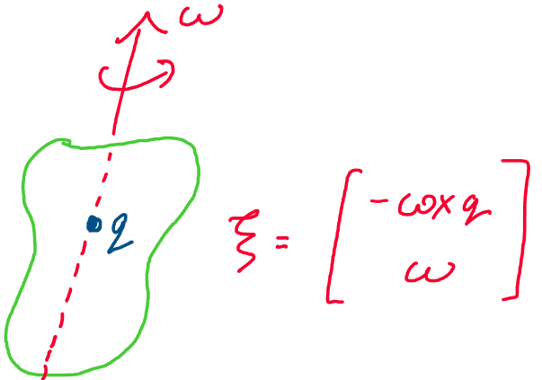\
*Above: a rigid body undergoes pure rotation about an axis $\omega$.*

The transformation representing a rotation of angle $\theta_r$ about the
axis $\omega$ was computed: 

$$\begin{aligned}
    g_{r} = e^{\hat\xi_{r}\theta_r}
\end{aligned}$$ 

For pure translational motion, we found that twists
followed the general format: 

$$\begin{aligned}
    \xi_{translation} = 
    \begin{bmatrix}
    v\\
    0
    \end{bmatrix} \in \mathbb{R}^6
\end{aligned}$$ 

Where $v\in \mathbb{R}^3$ is a unit vector pointing in
the direction of translation.

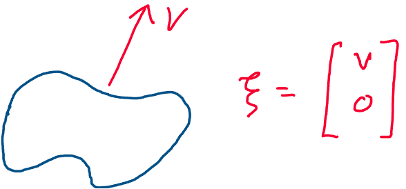\
*Above: a rigid body undergoes pure translation in direction $v$.*

Similar to the case of rotational motion, we could compute the
transformation of translating by distance $\theta_t$ along axis $v$ by
the exponential: 

$$\begin{aligned}
    g_{t} = e^{\hat\xi_{t}\theta_t}
\end{aligned}$$ 

After finding these two twists, we realized that we
could find the transformations associated with combined rotational and
translational motion through composing rotational and translational
transformations. We achieved this by matrix multiplication:

$$\begin{aligned}
    g_{combined} = e^{\hat\xi_r\theta_r}e^{\hat\xi_t\theta_t}
\end{aligned}$$ 

This meant that with our current level of understanding
of twists, we needed *two* twists and *two* scalars to represent a
combined rotational, translational motion.\
Instead of using two twists to represent this single rigid body motion
of combined rotation and translation, wouldn't it be more conventient if
we could just use one? We now want to find a *single* twist $\xi$ and
angle $\theta$ for any general rotational, translational transformation
$g$ such that: 

$$\begin{aligned}
    g = e^{\hat\xi\theta}
\end{aligned}$$ 

What could this single twist $\xi$ be? Let's begin by
thinking about combined rotational and translational motions in the real
world. One common practical example of a such a real rigid body motion
is a nut turning on a bolt.

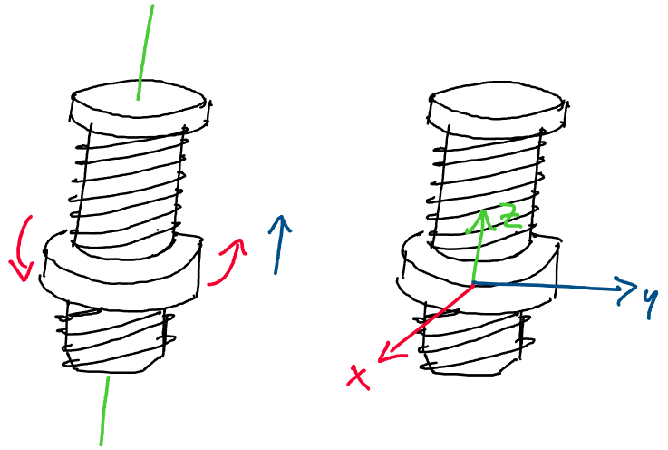\
*Above: a nut placed on a bolt translates along the bolt as it spins*

As we turn the nut on the bolt, we notice that *not only* does it spin
around the axis of the bolt, but it also *translates* along the axis of
the bolt!\
As we'll soon discover, we may represent *any* rigid body motion using a
class of transformations similar to the motion of a nut on a bolt.
Inspired by the example of the nut and bolt, we define a type of motion
called a **screw motion**.

```{prf:definition}
:label: screw_motion_defn
**Screw Motion**\
A screw motion is composed of the following sequence of rigid motions:

1.  Rotate about an axis $\omega \in \mathbb{R}^3$ by an angle
    $\theta \in \mathbb{R}$.

2.  Translate parallel to the same axis $\omega$ by a distance
    $d \in \mathbb{R}$.
```

We may visualize this as follows. First, we rotate some point $p$ about
the axis $\omega$ by some angle $\theta$, sweeping out a cone around the
axis as we go. Following this, we translate this point upwards by
distance $d$ along the axis $\omega$. After it's completed this rotation
and translation sequence, we say that the point $p$ has undergone a
screw motion.

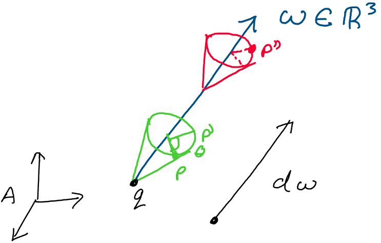\
*Above: a screw motion consists of a rotation about an axis followed by
a translation along that axis*

Take a moment to observe how the motion of the point $p$ rotating about
and translating along the axis $\omega$ mirrors the motion of a nut on a
bolt!

### Rotational Screw Motion

How may we describe these screw motions mathematically? For convenience,
we'll break up our analysis into two cases. Let's begin by considering
the case where some nonzero rotation about the axis occurs. We'll later
return to the case of pure translation.\
The first object we'll need to describe a rotational screw motion is a
**screw axis** - this is the axis we rotate about and translate along in
a screw motion.\
Whereas in exponential coordinates, it was enough to know the direction
of the axis of rotation, when describing screw motions, we know that we
need the screw axis for not only for rotation, but for *translation* as
well.\
This means that in addition to needing the direction of the axis,
$\omega$, we also need the position of the axis in space. With these
needs in mind, we define the axis of a screw, $l$, as follows:

$$\begin{aligned}
    l = \{q + \lambda \omega: \; \lambda \in \mathbb{R}\}
\end{aligned}$$ 

Where $q$ is a point on the axis and $\omega$ is the
unit direction vector of the axis.\
What does the scalar $\lambda$ contribute to the definition? Since we
define $\lambda$ to be any real number, it tells us that a screw axis is
defined by the set of *all* points along direction $\omega$ that pass
through point $q$.\
We may visualize this as follows:

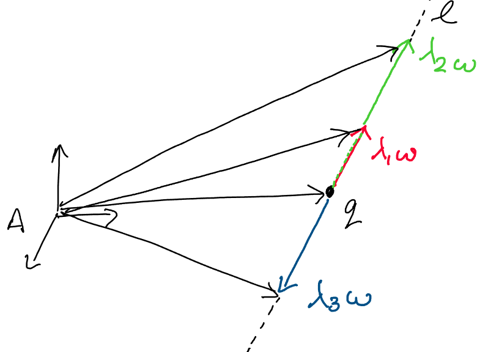\
*Above: a screw axis is defined by all of the points along direction
$\omega$ passing through point $q$*

What else do we need to represent our screw? In addition to having a
screw axis, we need to know *how much* movement has occurred. We may
quantify the amount of movement in a screw motion by the **magnitude**
of the screw, $M$.\
For the case of a nonzero rotational screw, the magnitude is defined
$M = \theta$, the amount of rotation that occurs about the screw axis.\
So far, we've dealt with the axis and the amount of rotation that
occurs - there's only one parameter that we haven't discussed thus far -
distance! When we think about representing the distance traveled in our
screw motion, we run into an interesting problem!\
We've already assigned the magnitude of the screw, a quantity which
represents the amount of distance traveled, to the amount of rotation
about the axis! How, then, do we account for the amount of translation
along the axis if we've already defined the magnitude of the screw to be
the angle?\
To take care of this conflict, we define our final screw term:
**pitch**. Pitch, $h$, is the ratio between the amount of rotation about
the screw axis and the amount of translation along the screw axis.\
We define pitch mathematically as: 

$$\begin{aligned}
    h = \frac{d}{\theta}
\end{aligned}$$ 

Where $d$ is the distance we translate along the axis
and $\theta$ is the distance we rotate about the axis. Using this term,
we can avoid specifying two separate measures of distance traveled for
our screw.\
Why else do we take this approach? We know that in the future, we'll
want to represent screw motions with a single scalar parameter - after
all, our investigation of screw motions was inspired by our search for a
single twist $\xi$ and single scalar $\theta$ for combined rotational
and translational motions.\
If we define that single scalar parameter to be the angle we rotate
about the axis, $\theta$, we know that we can find the distance we
translate along the axis simply by multiplying the pitch of the screw by
the angle we rotate. 

$$\begin{aligned}
    d = h\theta
\end{aligned}$$ 

Pitch simply gives us a convenient way to "knock out\"
one parameter of distance in our description of motion, and allows us to
use our angle of rotation $\theta$ as a single measure of distance to
represent both rotational and translational displacement.

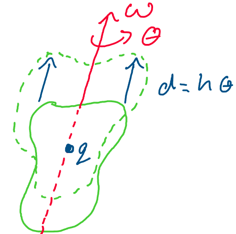\
*Above: using pitch, we may find the linear displacement $d$ of a rigid
body given the angular displacement $\theta$.*

In summary, a screw motion with nonzero rotation involves a rotation
about a screw axis $l = \{q + \lambda \omega: \lambda \in \mathbb{R}\}$
by an angle $\theta$ and translation parallel to the screw axis by a
distance $d = h\theta$.

### Translational Screw Motion

How do these concepts of screw motion translate into the case of *pure*
translational motions? Let's try to define the same three terms - axis,
magnitude, and pitch - for a translational motion.\
First, let's look at the screw axis, $l$. We may define $l$ using a unit
vector $v$, which points in the direction of translation:

$$\begin{aligned}
    l = \{\lambda v: \; \lambda \in \mathbb{R} \}
\end{aligned}$$ 

Using this definition, we may visualize this screw axis
as the following line which passes through the origin and points along
direction $v$:

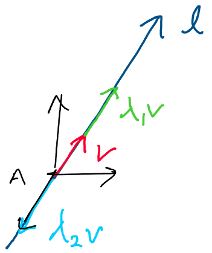\
*Above: The screw axis for a pure translation passes through the origin
and points along direction $v$.*

As no rotation occurs, we may describe the magnitude of a purely
translational screw motion by the amount of linear displacement, $d$:

$$\begin{aligned}
    M_{translational} = d
\end{aligned}$$

Finally, let's consider the behavior of the pitch of the
screw, $h$, in the case of pure translation. Let's think back to our
definition of pitch: 

$$\begin{aligned}
    h = \frac{d}{\theta}
\end{aligned}$$ 

We know that in the purely translational case, angular
displacement, $\theta$, is zero! Taking the limit of the definition
above as $\theta$ approaches $0$, we conclude that in the case of pure
translational motion: 

$$\begin{aligned}
    h_{translational} = \lim_{\theta \to 0} \; \frac{d}{\theta} = \infty
\end{aligned}$$ 

What does this mean practically? All that the above
expresses is that for a translational screw motion, we don't need any
rotation to have a translation occur.\
Let's take a moment to collect our thoughts and summarize what we've
learned about the two types of screw motions.

1.  **Nonzero rotational motion:** In the case of a screw motion with
    nonzero rotation, where we rotate by $\theta$ and translate by $d$
    along an axis $\omega$, we describe the screw using the following
    axis, magnitude, and pitch: 
    
    $$\begin{aligned}
            l &=  \{q + \lambda \omega: \; \lambda \in \mathbb{R}\}\\
            M &= \theta\\
            h &= \frac{d}{\theta}
    \end{aligned}$$ 
    
    Where pitch is a term that allows us to describe
    rotational and translational motion using only a single angular
    displacement, $\theta$.\
    Note that for the case of pure rotation, $h = 0$.

2.  **Translational motion:** In the case of purely translational screw
    motion, where we translate along an axis $v$ by distance $d$, we
    describe the screw using the following axis, magnitude, and pitch:

    $$\begin{aligned}
            l &=  \{\lambda v: \; \lambda \in \mathbb{R}\}\\
            M &= d\\
            h &= \infty
    \end{aligned}$$ 
    
    Where the pitch $h = \infty$ is derived from the
    definition of pitch as the ratio of linear to angular displacement.

## Describing Screw Motion

### From Screws to Twists

Now that we've come up with a definition for a screw motion, let's see
how we may describe screw motion using the language of rigid body
transformations. Previously, we found that twists are a convenient way
of representing rigid body transformations - is there some link between
twists and screws that we can take advantage of?

```{prf:proposition}
:label: ScrewIsTwist
**Every screw motion is associated with a twist**\
Given any screw with axis $l$, magnitude $M$, and pitch $h$, there
exists a twist $\xi \in \mathbb{R}^6$ and a scalar
$\theta \in \mathbb{R}$ such that the transformation: 

$$\begin{aligned}
    g = e^{\hat\xi\theta}
\end{aligned}$$ 

Is equivalent to the screw motion about axis $l$ with
magnitude $M$ and pitch $h$.
```

What is this proposition saying? This proposition states that for every
screw motion out there, we may find a twist such that the exponential of
the twist with some angle produces a transformation in $SE(3)$
equivalent to the screw.

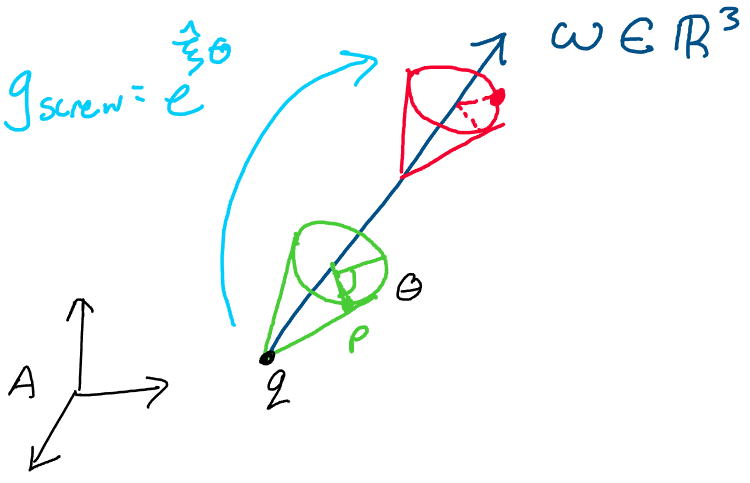\
*Above: there is some twist $\xi$ and scalar $\theta$ corresponding to
every screw motion.*

**Proof:** We'll prove this proposition by breaking it up into two
cases: that of a nonzero rotational screw and a purely translational
screw. Note that these two cases correspond to the two types of screws
we defined above.\
**Rotational Case**\
Let's begin with the case of a nonzero rotational screw. To show that
the proposition holds for this case, we'll find an explicit formula for
the twist $\xi$ corresponding to the screw motion.\
Consider the following screw motion with nonzero rotation. Suppose we
have a screw axis pointing in direction $\omega$ and passing through
point $q$, a screw magnitude of $M = \theta$, and a pitch of
$h = d/\theta$.\
Let's think about how we may we describe the motion of an arbitrary
point $p$ under this screw motion. Once we begin developing the
equations of motion, the formula for the twist of this screw motion will
naturally fall out.

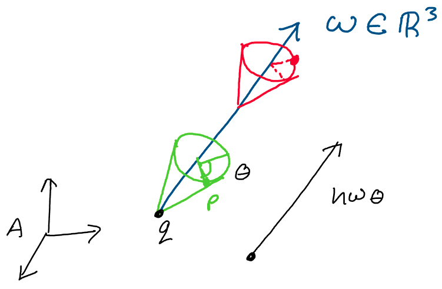\
*Above: an arbitrary screw motion with an axis pointing in direction
$\omega$, a magnitude $\theta$, and a pitch $h$*

Let $g$ be the rigid body transformation associated with this screw
motion. Let's see if we can find an expression for $g(p)$, the
transformation of point $p$ due to the screw motion.\
We can think about the transformation of this point by examining the two
parts of screw motions - rotation by $\theta$ about the screw axis and
translation by $d = h\theta$ along the screw axis.\
First, let's think about the transformation of $p$ due to rotation.
Where does the point $p$ end up after a rotation by angle $\theta$
around the axis $\omega$? Let's redraw the figure from above in greater
detail and see if we can gain any further insight.

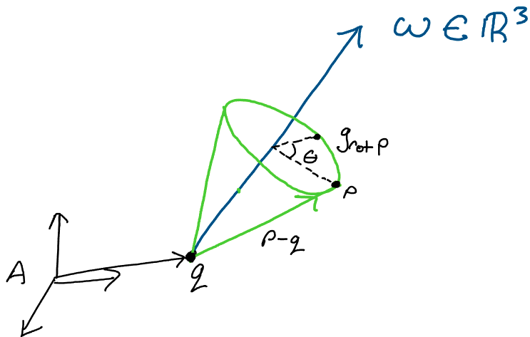

First, from our knowledge of exponential coordinates for rotations, we
know that the rotation matrix associated with rotating by angle $\theta$
about a unit axis $\omega$ is given by $R = exp(\hat\omega\theta)$.\
From the image above, we observe that the rotation of point $p$ about
the axis $\omega$ may be described by: 

$$\begin{aligned}
    g_{rot}(p) &= q + R(p-q)\\
    g_{rot}(p) &= q + e^{\hat\omega\theta}(p-q)
\end{aligned}$$ 

Where $q$ takes us to the axis of rotation and
$exp(\hat\omega\theta)(p-q)$ computes the rotation of the point around
the axis.\
Following this rotation, we want to complete the second part of the
screw motion: translating in $\omega$ by distance $d$. How do we express
this translation in terms of the screw parameters? Using the pitch of
the screw, we may compute the translational motion of point $p$ by
distance $d$ in direction $\omega$ by: 

$$\begin{aligned}
    g_{transl}(p) &= p + d\omega\\
    g_{transl}(p) &= p + \frac{d}{\theta}\theta\omega\\
    g_{transl}(p) &= p + h\theta\omega
\end{aligned}$$ 

Now that we have both the rotational and translational
parts of the screw motion, we simply add the rotational and
translational components together to find the total transformation from
the screw motion: 

$$\begin{aligned}
    g(p) &= q + e^{\hat\omega\theta}(p-q) + h\theta\omega
\end{aligned}$$ 

Let's now express this in homogeneous coordinates, and
see if we can write the transformation associated with the screw motion
as a matrix in $SE(3)$.\
To convert the expression into homogeneous coordinates, we append a 1 to
the bottom of the expression above: 

$$\begin{aligned}
    g\begin{bmatrix}
    p\\
    1
    \end{bmatrix}
    &= 
    \begin{bmatrix}
    q + e^{\hat\omega\theta}(p-q) + h\theta\omega\\
    1
    \end{bmatrix}
\end{aligned}$$ 

Let's see if we can extract $p$ in homogeneous
coordinates on the right hand side to match the left hand side of the
equation. If we're able to do this, we'll have figured out a value for
the transformation matrix $g$! 

$$\begin{aligned}
    g\begin{bmatrix}
    p\\
    1
    \end{bmatrix}
    &= 
    \begin{bmatrix}
    q + e^{\hat\omega\theta}p-e^{\hat\omega\theta}q + h\theta\omega\\
    1
    \end{bmatrix}\\
     g\begin{bmatrix}
    p\\
    1
    \end{bmatrix}
    &= 
    \begin{bmatrix}
    e^{\hat\omega\theta}p + (I_3 -e^{\hat\omega\theta})q + h\theta\omega \\
    1
    \end{bmatrix}\\
     g\begin{bmatrix}
    p\\
    1
    \end{bmatrix}
    &= 
    \begin{bmatrix}
    e^{\hat\omega\theta} & (I_3 -e^{\hat\omega\theta})q + h\theta\omega \\
    0 & 1
    \end{bmatrix}
    \begin{bmatrix}
    p\\
    1
    \end{bmatrix}
\end{aligned}$$ 

As we have a $[p, \; 1]$ on the left and right of the
equation, we conclude that the matrix $g$ of the rotational screw motion
must be: 

$$\begin{aligned}
    g = 
    \begin{bmatrix}
    e^{\hat\omega\theta} & (I_3 -e^{\hat\omega\theta})q + h\theta\omega \\
    0 & 1
    \end{bmatrix}
\end{aligned}$$ 

As it must be equal to the $g$ on the left side of the
equation.\
Let's look at the different terms in this matrix. We know from our
knowledge of exponential coordinates that the term in the top left,
$exp(\hat\omega\theta) \in SO(3)$, and from matrix multiplication that
the term in the top right is a point in $\mathbb{R}^3$.\
Because of this, we conclude that the transformation matrix for a
rotational motion is of the correct form: 

$$\begin{aligned}
    g = \begin{bmatrix}
    R & p \\
    0 & 1
    \end{bmatrix} \in SE(3)
\end{aligned}$$ 

This interesting development opens up many new
opportunities for screw coordinates. From our knowledge of twists, we
know that we may find a twist for every transformation $g \in SE(3)$.
Since we just proved that every rotational screw motion is a rigid body
transformation in $SE(3)$, we conclude that we *must* be able to find a
twist $\xi \in \mathbb{R}^6$ for every rotational screw transformation!\
Let's solve for the twist associated with a nonzero screw motion. Recall
that in general, a twist for nonzero rotation has the form:

$$\begin{aligned}
    \xi = 
    \begin{bmatrix}
    v\\
    \omega
    \end{bmatrix}
\end{aligned}$$ 

And that we may compute $exp(\hat\xi\theta)$ for this
nonzero rotational twist as: 

$$\begin{aligned}
    exp(\hat\xi\theta) = 
    \begin{bmatrix}
    e^{\hat\omega\theta} & (I_3 - e^{\hat\omega\theta})\hat\omega v + \omega \omega ^T v\theta\\
    0 & 1
    \end{bmatrix}
\end{aligned}$$ 

Let's match the entries of this matrix with the entries
of the screw transformation matrix, $g$, from above! We'll then proceed
to solve for $\omega$ and $v$, the vectors needed to define the twist.

$$\begin{aligned}
    g &= e^{\hat\xi\theta}\\
    \begin{bmatrix}
    e^{\hat\omega\theta} & (I_3 -e^{\hat\omega\theta})q + h\theta\omega \\
    0 & 1
    \end{bmatrix} &= \begin{bmatrix}
    e^{\hat\omega\theta} & (I_3 - e^{\hat\omega\theta})\hat\omega v + \omega \omega ^T v\theta\\
    0 & 1
    \end{bmatrix}
\end{aligned}$$ 

Right away, we may match the upper left terms of these
matrices to find: 

$$\begin{aligned}
    e^{\hat\omega\theta} = e^{\hat\omega\theta}
\end{aligned}$$ 

If these two terms are to be equal, the $\omega$ vector
for a twist of a screw must be the same $\omega$ vector from the screw
axis!\
Now that we have the $\omega$ of the twist, we may move on to solve for
the velocity of the twist in terms of the screw components. Instead of
solving for the velocity directly, let's see if we can make an educated
guess as to the form of velocity. Then, we'll formally verify that this
guess is correct.\
We know that for a purely rotational motion, the velocity of a twist
$(v, \omega)$ is: 

$$\begin{aligned}
    v_{rotation} = -\omega \times q
\end{aligned}$$ 

What about for pure translation? For pure translation,
the velocity of the twist $(v, 0)$ is the vector pointing in the
direction of translation, $v$. For a screw motion, we know that this
direction of translation is the same as the axis of rotation, $\omega$.

$$\begin{aligned}
    v_{transl} = \omega
\end{aligned}$$ 

Is there some way we can bring these rotational and
translational velocities together into a single twist? Remember, we want
to find a *single* twist $\xi$ such that: 

$$\begin{aligned}
    e^{\hat\xi\theta} = g
\end{aligned}$$ 

Where $g$ is a transformation involving both rotation
and translation and $\theta$ is the angle of rotation.\
Our first instinct might be to add the rotational and translational
twist velocities directly. Does this give us what we want?\
Since we use a single angle $\theta$ to describe both the rotational and
translational motion, to find the total velocity term of a screw, we
*can't* simply add the twist velocities for rotation and translation -
the amount of rotation and translation might be different, and simply
adding them will give the same weight to rotation and translation!\
Thus, we *first* must scale the translational portion of the screw by
$h$, the pitch. This way, we'll get the correct amount of translation,
$d = h\theta$, for an arbitrary rotation by angle $\theta$.\
Adding the twist velocity for a purely rotational twist to the scaled
twist velocity of a translational twist, we arrive at the formula for
the twist velocity of a screw: 

$$\begin{aligned}
    v = -\omega \times q + h\omega = -\hat\omega q + h\omega
\end{aligned}$$ 

Where we use $h\omega$ to scale the amount of rotation,
$\theta$, to the correct amount of translation, $d = h\theta$ along the
axis $\omega$.\
Let's verify that this twist velocity gives us the transformation we
want! To do this, we will compare the upper right terms of the matrices
$g$ and $exp(\hat\xi\theta)$, as these are the only terms involving this
velocity. 

$$\begin{aligned}
    \begin{bmatrix}
    e^{\hat\omega\theta} & (I_3 -e^{\hat\omega\theta})q + h\theta\omega \\
    0 & 1
    \end{bmatrix} &= \begin{bmatrix}
    e^{\hat\omega\theta} & (I_3 - e^{\hat\omega\theta})\hat\omega v + \omega \omega ^T v\theta\\
    0 & 1
    \end{bmatrix}\\
    (I_3 -e^{\hat\omega\theta})q + h\theta\omega
    &\stackrel{?}{=} 
    (I_3 - e^{\hat\omega\theta})\hat\omega v + \omega \omega ^T v \theta
\end{aligned}$$ 

If these terms are equal after plugging in the formula
for $v$, we know that the two matrices are equal and that this velocity
is correct. Let's try it out! Substituting $v$ into its first appearance
on the right hand side, we get: 

$$\begin{aligned}
     (I_3 -e^{\hat\omega\theta})q + h\theta\omega &= (I_3 - e^{\hat\omega\theta})\hat\omega(-\hat\omega q + h\omega) + \omega \omega ^T v\theta
\end{aligned}$$ 

Let's begin breaking this equality down. First, we
notice that in both equations, we have a term involving
$(I_3 - e^{\hat\omega\theta})$ multiplied by some point, and a term
involving $\theta$ multiplied by some vector. If the two sides of the
equation are to be equal, then we can show that these two terms must be
equal!\
Let's focus on the second term, the vector multiplied by $\theta$. If
the second terms on both sides of the equation are equal, we require:

$$\begin{aligned}
    h\theta\omega &= \omega\omega^Tv\theta\\
    \omega h \theta &= \omega\omega^Tv\theta
\end{aligned}$$ 

We notice that on both sides, we have a vector $\omega$
multiplied by a scalar ($h$ on the left and $\omega^Tv$ on the right)
and the angle $\theta$. Thus, for these two sides to be equal, the value
of $h$ *must* be $h = \omega^Tv$! Let's apply this formula for $h$ to
bring our overall equation one step closer to an equality.

$$\begin{aligned}
    (I_3 -e^{\hat\omega\theta})q + h\theta\omega &= (I_3 - e^{\hat\omega\theta})\hat\omega(-\hat\omega q + h\omega) + \omega \omega ^T v\theta\\
    (I_3 -e^{\hat\omega\theta})q + h\theta\omega &= (I_3 - e^{\hat\omega\theta})\hat\omega(-\hat\omega q + h\omega) + h\theta \omega\\
    (I_3 -e^{\hat\omega\theta})q + h\theta\omega &= (I_3 - e^{\hat\omega\theta})(\hat\omega(-\hat\omega q)  + h \hat\omega \omega) + h\theta \omega
\end{aligned}$$ 

Since the cross product of any vector with itself equals
zero, the $\hat\omega\omega = \omega \times \omega$ term becomes zero,
which leaves us with: 

$$\begin{aligned}
    (I_3 -e^{\hat\omega\theta})q + h\theta\omega &= (I_3 - e^{\hat\omega\theta})(-\hat\omega^2 q) + h\theta \omega
\end{aligned}$$ 

We're almost there! We now have one $\hat\omega^2$ term
remaining - how can we replace it with something easier to work with? We
recall the following identity, which we developed when discussing skew
symmetric matrices: 

$$\begin{aligned}
    \hat\omega^2 = \omega\omega^T - I_3
\end{aligned}$$ 

Let's plug this in, and see if it helps us get any
closer to our goal equation. 

$$\begin{aligned}
    (I_3 -e^{\hat\omega\theta})q + h\theta\omega &= (I_3 - e^{\hat\omega\theta})(I_3 - \omega\omega^T)q + h\theta \omega\\
    (I_3 -e^{\hat\omega\theta})q + h\theta\omega &= (I_3 - e^{\hat\omega\theta})(q - \omega\omega^Tq) + h\theta \omega\\
    (I_3 -e^{\hat\omega\theta})q + h\theta\omega &= (I_3 - e^{\hat\omega\theta})q - (I_3 - e^{\hat\omega\theta})(\omega\omega^Tq) + h\theta \omega
\end{aligned}$$ 

When we check the formula for the upper right hand term
of a twist, we find that this is *almost* it! We only have one extra
term: 

$$\begin{aligned}
    (I_3 - e^{\hat\omega\theta})(\omega\omega^Tq)
\end{aligned}$$ 

Thus, to show that the two sides of the equation are
equal using our velocity formula, all that we need to do is prove that
this one leftover term is equal to zero. If this term drops out, we'll
end up with the same equation on both sides!\
Let's try proving this term is equal to zero by substituting in the
definition of the matrix exponential! 

$$\begin{aligned}
    (I_3 - e^{\hat\omega\theta})(\omega\omega^Tq) &= (I_3 - (I_3 + \hat\omega\theta + \frac{\hat\omega^2\theta^2}{2!} + ...))(\omega\omega^Tq)\\
    &= (I_3 - I_3 - \hat\omega\theta - \frac{\hat\omega^2\theta^2}{2!} - ...)(\omega\omega^Tq)\\
    &= (-\hat\omega\theta - \frac{\hat\omega^2\theta^2}{2!} - ...)(\omega\omega^Tq)\\
    &= -\hat\omega\theta(\omega\omega^Tq) - \frac{\hat\omega^2\theta^2}{2!}(\omega\omega^Tq) - ...\\
    &= -\hat\omega\omega\omega^Tq\theta - \frac{\hat\omega^2\omega\omega^Tq}{2!} \theta^2- ...
\end{aligned}$$ 

Since the cross product of any vector with itself is
equal to the zero vector, and
$\hat\omega \omega = \omega \times \omega$, we see that *every* term in
this series will become zero! Thus, we conclude: 

$$\begin{aligned}
    (I_3 - e^{\hat\omega\theta})(\omega\omega^Tq) = 0 + 0 + 0 + ... = 0
\end{aligned}$$ 

Substituting this result back into our formula for the
upper right term of the transformation matrix: 

$$\begin{aligned}
    (I_3 - e^{\hat\omega\theta})q + h\theta \omega &= (I_3 - e^{\hat\omega\theta})q + 0 + h\theta \omega\\
    (I_3 - e^{\hat\omega\theta})q + h\theta \omega &= (I_3 - e^{\hat\omega\theta})q + h\theta \omega
\end{aligned}$$ 

Thus, we conclude that the upper right terms of the two
matrices are equal for our choice of twist velocity, $v$. We have
therefore proven that the twist velocity associated with a rotational
screw motion is: 

$$\begin{aligned}
    v = -\omega \times q + h\omega
\end{aligned}$$ 

We've now found a closed form formula for *both* the
angular velocity $\omega$ and velocity $v$ of a twist corresponding to
an arbitrary screw motion! In conclusion, for a twist with nonzero
rotation: 

$$\begin{aligned}
    \xi = \begin{bmatrix}
    v\\
    \omega
    \end{bmatrix}
    = 
    \begin{bmatrix}
    -\omega \times q + h\omega\\
    \omega
    \end{bmatrix}
\end{aligned}$$ 

Notice that this twist is the *sum* of the twist for a
purely rotational motion and the twist for a purely translational
motion.\
Let's take a brief moment to discuss the significance of this process.
By finding a $\xi = (v, \omega)$ makes $exp(\hat\xi\theta)$ equal to the
screw transformation matrix, we've shown that *every* rotational screw
motion may be represented by a twist!\
This gives us the power to find the rigid body transformation associated
with any nonzero rotational screw motion. For example, for a twist $\xi$
of the form above, we now know that the transformation associated with
the screw is: 

$$\begin{aligned}
    g_{screw} = e^{\hat\xi\theta}
\end{aligned}$$

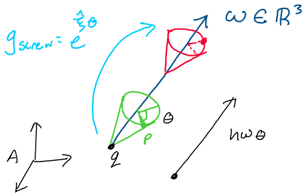\
*Above: We may represent a screw motion of nonzero rotation using a
transformation $g = e^{\hat\xi\theta}$, where $\xi$ is the twist
corresponding to the screw.*

**Translational Case**\
So far, we've made a point out of this particular formula for $\xi$
*only* applying to the case of nonzero rotational screw motion. What if
the rotation $is$ zero, and we experience a purely translational screw
motion? Can we still find a twist associated with a purely translational
screw?\
Thankfully, as with our purely translational developments in the past,
this case is *much* simpler to analyze than the case of combined
rotation and translation.\
Recall that earlier, we stated that the axis of a translational screw
was a line pointing in the direction of translation, $v$, that passes
through the origin: 

$$\begin{aligned}
    l = \{ \lambda v: \; \lambda \in \mathbb{R}\}
\end{aligned}$$ 

Recall that the twist $\xi$ associated with a purely
translational motion is of the form: 

$$\begin{aligned}
    \xi = \begin{bmatrix}
    v\\
    0
    \end{bmatrix}
\end{aligned}$$ 

Where $v$ is a unit vector pointing in the direction of
translation.\
For a translational screw motion, we already know what this vector $v$
is! The direction of the screw axis, $v$, is exactly this unit vector
which points in the direction of translation.\
Thus, for any purely translational screw, we may define the twist
associated with the screw as: 

$$\begin{aligned}
    \xi = \begin{bmatrix}
        v\\
        0
    \end{bmatrix}
\end{aligned}$$ 

Thus, in addition to having shown that any *rotational*
screw motion may be represented by a twist, we now know that any
*translational* screw motion may be represented by a twist. This
completes the proof! $\square$\
\
Before we summarize our results from this section, let's pause for a
moment and discuss why we needed to treat the purely translational case
separately from the rotational case. Why couldn't we just use the same
formula?\
Let's take a second look at the twist of a nonzero rotational screw:

$$\begin{aligned}
    \xi = \begin{bmatrix}
    -\omega\times q + h\omega\\
    \omega
    \end{bmatrix}
\end{aligned}$$ 

Does this formula still apply in the translational case?
For a translational motion, we know that $\omega = 0$, as no rotation
occurs. Let's plug this into the twist formula above and see what we
get: 

$$\begin{aligned}
    \xi = \begin{bmatrix}
    0 + 0\\
    0
    \end{bmatrix} = 0 \in \mathbb{R}^6
\end{aligned}$$ 

When we plug in $\omega = 0$, the condition for
translational motion, we end up with the zero vector! Since formula
gives the zero vector for *any* translational motion in *any* direction,
there's no way that we can use this formula for the translational case.
This is what motivates the need for a separate twist formula for
translational screws.\
Let's summarize everything we've learned in this section. As we may find
a twist for both the rotational and translational cases of screw motion,
we conclude that we may find a twist corresponding to *any* screw
motion! These twists are defined differently for the two cases of screw
motion.

1.  **Nonzero rotational screw:** A rotational screw with an axis of
    rotation: 
    
    $$\begin{aligned}
            l = \{ q + \lambda \omega: \; \lambda \in \mathbb{R} \}
    \end{aligned}$$ 
    
    (where $q$ is a point on the axis and $\omega$ is a
    unit vector), a magnitude $M = \theta$ (the angle of rotation), and
    a pitch $h = d/\theta$, where $d$ is the total translational
    distance, is associated with the screw: 
    
    $$\begin{aligned}
            \xi = 
            \begin{bmatrix}
                -\omega \times q + h\omega\\
                \omega
            \end{bmatrix}
    \end{aligned}$$ 
    
    Where $-\omega\times q$ is the component of the
    twist velocity $v$ that comes from rotating about the screw axis,
    and $h\omega$ is the component of $v$ that comes from translating
    along the screw axis.

2.  **Translational screw:** A translational screw with a screw axis:

    $$\begin{aligned}
            l = \{ \lambda v: \; \lambda \in \mathbb{R} \}
    \end{aligned}$$ 
    
    where $v$ is a unit vector pointing in the direction
    of translation, a magnitude $M = d$ (the distance translated), and a
    pitch $h = \infty$ (since no rotation occurs) may be represented by
    the twist: 
    
    $$\begin{aligned}
            \xi = 
            \begin{bmatrix}
                v\\
                0
            \end{bmatrix}
    \end{aligned}$$

### From Twists to Screws

So far, we've only examined the relationship between screws and twists
in a single direction of relation. We showed that given an arbitrary
screw motion, which may be rotational or purely translational, we can
*always* find a twist associated with the screw. Can we do this in the
opposite direction as well?\
Given an arbitrary twist $\xi$, can we always find a screw axis, pitch,
and magnitude corresponding to that twist, or are there certain cases
where we can't? In this section, we'll show that *every* twist is
associated with a screw!

```{prf:proposition}
:label: twistIsScrew
**Every twist is associated with a screw**\
Given an arbitrary twist $\xi = (v, \omega) \in \mathbb{R}^6$ and scalar
$\theta$, there exists a screw axis $l$, a screw magnitude $M$, and a
screw pitch $h$ such that the transformation: 

$$\begin{aligned}
    g = e^{\hat\xi\theta}
\end{aligned}$$ 

Is equivalent to the screw motion about axis $l$ with
magnitude $M$ and pitch $h$.
```


**Proof:** Whereas in the previous section, we showed that we may find a
twist $\xi = (v, \omega)$ for every screw motion, here, we'd like to go
the opposite direction! We now want to prove that there is a screw
motion corresponding to every twist transformation
$g = exp(\hat\xi\theta)$.\
This proof will be very similar in structure and in mathematics to the
previous section, as we're simply attempting to prove the previous
proposition in reverse.\
**Rotational Case**\
Let's begin with the case of nonzero rotation. We know that the twist
associated with a nonzero rotation will be of the form:

$$\begin{aligned}
    \xi = 
    \begin{bmatrix}
        v\\
        \omega
    \end{bmatrix}
\end{aligned}$$ 

And that the scalar associated with this twist is
$\theta$, the angle of rotation about a unit axis $\omega$. We now want
to solve for the screw axis, magnitude, and pitch.\
Recall that the axis of a rotational screw is defined: 

$$\begin{aligned}
    l = \{ q + \lambda \omega: \; \lambda \in \mathbb{R} \}
\end{aligned}$$

 Where $\omega$ is the axis of rotation of the screw.
Since we already have the direction of the axis, $\omega$, from our
twist, $\xi$, all that remains to complete our definition of the screw
axis is to find a point $q$ on the axis in terms of $v$ and $\omega$.\
How might we accomplish this? Let's compare the terms in the
transformation matrix for a screw with the matrix $e^{\hat\xi\theta}$.
Using the mathematics that we developed above, if the screw and twist
are to represent the same motion, their transformation matrices must be
the same: 

$$\begin{aligned}
    g_{screw} &= g_{twist} = e^{\hat\xi\theta}\\
    \begin{bmatrix}
    e^{\hat\omega\theta} & (I_3 -e^{\hat\omega\theta})q + h\theta\omega \\
    0 & 1
    \end{bmatrix}
    &= 
    \begin{bmatrix}
    e^{\hat\omega\theta} & (I_3 - e^{\hat\omega\theta})\hat\omega v + \omega \omega ^T v\theta\\
    0 & 1
    \end{bmatrix}
\end{aligned}$$

Right away, we notice that the upper right entry of the
matrix is the only one containing the point $q$. Thus, we focus in on
the terms in the upper right, and equate them: 

$$\begin{aligned}
    (I_3 -e^{\hat\omega\theta})q + h\theta\omega &= (I_3 - e^{\hat\omega\theta})\hat\omega v + \omega \omega ^T v\theta
\end{aligned}$$ 

We observe that both of these expressions may be split
into two parts, just as with our proof in the previous section! The
first part consists of $(I_3 - e^{\hat\omega\theta})$ multiplied by some
vector, while the second part consists of $\theta$ multiplied by some
vector. If we're able to find a way to make both of these parts equal to
their counterparts on the other side of the equation, we'll have solved
the equality.\
Let's solve for $q$ by equating the first terms! 

$$\begin{aligned}
    (I - e^{\hat\omega\theta})q &= (I_3 - e^{\hat\omega\theta})\hat\omega v
\end{aligned}$$ 

From the above, it's clear that the value of $q$ which
makes these terms equal is: 

$$\begin{aligned}
    q = \hat\omega v = \omega \times v
\end{aligned}$$ 

Thus, we may compute a point on the axis of rotation in
terms of $v$ and $\omega$ by $q = \omega \times v$. This allows us to
represent the axis of a screw corresponding to a twist as:

$$\begin{aligned}
    l = \{q + \lambda \omega:\; \lambda \in \mathbb{R}\}
    = \{\omega \times v + \lambda \omega:\; \lambda \in \mathbb{R}\}
\end{aligned}$$ 

Now, we're ready to solve for the pitch of the screw,
$h$. We notice that just like $q$, $h$ is found in the upper right term
of one of the transformation matrices. We already know that we've found
a point $q$ to make the first part of these upper right terms equal.
Now, to finish the job, we must solve for a pitch $h$ to make the second
part of these upper right terms equal.\
Equating the second parts of the upper right terms, we find:

$$\begin{aligned}
    h\theta\omega &= \omega\omega^Tv\theta\\
    h\theta\omega &= \omega^Tv\theta \omega
\end{aligned}$$

Where in the last step, we use the fact that
$\omega^T v$ is a scalar to rearrange the expression. Now, we observe
that on both sides of the equation, we have a scalar multiplied by
$\theta\omega$. Thus, to make both sides of the equation equal, we
choose: 

$$\begin{aligned}
    h = \omega^Tv
\end{aligned}$$ 

The pitch of a twist in terms of $\omega$ and $v$ is
therefore calculated $h = \omega^T v$.\
Now that we have the axis and the pitch, the one remaining term we have
to compute is the magnitude of the screw, $M$. We know that by
definition, the magnitude of a rotational screw is the angle of
rotation, $\theta$. Thus, for a screw with nonzero rotation:

$$\begin{aligned}
    M = \theta
\end{aligned}$$ 

We've now found a screw axis, magnitude, and pitch
corresponding to a twist $\xi \in \mathbb{R}^6$ and a scalar
$\theta \in \mathbb{R}$. This completes the proof of the rotational
case.\
Let's summarize what we just proved, and how it ties in with the overall
goal of this proof. In this proof, we're aiming to show that there is a
screw corresponding to every twist. We're accomplishing this by showing
that we can find formulas for the parameters of a screw (axis, pitch,
and magnitude) in terms of the parameters of a twist $(v, \omega)$. To
solve for these quantities in terms of each other, we chose to equate
the transformation matrix of a screw with the transformation matrix of a
twist.\
**Translational Case**\
We may complete the proof by analyzing the case of pure translational
motion. Given a twist $\xi = (v, 0) \in \mathbb{R}^6$ and a distance
$\theta$ corresponding to a pure translational motion, we want to find a
screw motion corresponding to this twist.\
First, we'll solve for the screw axis. We know that for the
translational case, the screw axis is the line passing through the
origin along the direction of translation. Since for a translational
twist, $\xi = (v, 0)$, the vector $v$ is a unit vector pointing in the
direction of translation, we already have all we need to express the
screw axis! 

$$\begin{aligned}
    l = \{ \lambda v:\; \lambda \in \mathbb{R} \}
\end{aligned}$$

Now, we must find the magnitude and pitch. Recall that
for a purely translational screw, we define the screw magnitude to be
the distance traveled along the screw axis. Thus, for a purely
translational screw: 

$$\begin{aligned}
    M = \theta
\end{aligned}$$

Where $\theta$ is the amount of translation that
occurs.\
Finally, we must solve for the pitch of the screw corresponding to the
pure translational motion. Recall that when defining pitch, we stated
that whenever we have a nonzero translation but zero rotation, the pitch
of a screw will be infinite! Thus, the pitch $h$ corresponding to
$\xi = (v, 0)$ is: 

$$\begin{aligned}
    h = \infty
\end{aligned}$$ 

Recall that this fact comes from the definition of pitch
as the ratio of translation to rotation, and the amount of rotation
being zero in this case.\
Now that we've identified the three screw parameters, we've found a
screw corresponding to an arbitrary translational twist
$\xi = (v, 0) \in \mathbb{R}^6$.\
Since we were able to find a formula for all of the screw motion
parameters in the case of rotational and non-rotational motion, we
conclude that we may always find a screw motion corresponding to a
twist. This completes the proof! $\square$\
\
We'll conclude our discussion of screws with a summary of the
relationship between screws and twists. As always, we'll split it into
the two possible cases: nonzero rotational motion and translational
motion.

1.  **Nonzero rotational motion:** Given a twist $\xi = (v, \omega)$
    corresponding to a nonzero rotation, where $\omega$ is a unit vector
    along the axis of rotation, the transformation $exp(\hat\xi\theta)$
    is equivalently expressed by the screw motion: 
    
    $$\begin{aligned}
            l &= \{\omega \times v + \lambda \omega:\; \lambda \in \mathbb{R}\}\\
            M &= \theta\\
            h &= \omega^T v
    \end{aligned}$$ 
    
    Where $l$ is the screw axis, $M$ is the magnitude,
    and $h$ is the pitch.

2.  **Translational motion:** Given a twist $\xi = (v, 0)$ corresponding
    to a purely translational motion, where $v$ is a unit vector
    pointing in the direction of translation, the transformation
    $exp(\hat\xi\theta)$ is equivalently expressed by the screw:

    $$\begin{aligned}
            l &= \{ \lambda v:\; \lambda \in \mathbb{R} \}\\
            M &= \theta\\
            h &= \infty
    \end{aligned}$$ 
    
    Where $l$ is the screw axis, $M$ is the magnitude,
    and $h$ is the pitch.

## Chasles' Theorem

What does all of this theory about screw motion *really* add up to when
we think about its importance in describing rigid body motion? In this
section, we'll discuss an important theorem that gives context to the
value of screw motion.\
Before we dive into this theorem, however, we'll need to be equipped
with the following fact about the matrix exponential.

```{prf:lemma}
:label: commutative_exp
Given two matrices $A, B \in \mathbb{R}^{n\times n}$, if
$AB = BA$ then: 

$$\begin{aligned}
    e^{A+B} = e^Ae^B
\end{aligned}$$ 

Note that the condition $AB = BA$ may also be written as
$[A, B] = 0$, where $[\cdot, \cdot]$ is called the commutator of two
matrices, defined $[X, Y] = XY - YX$.
```

Keep this important fact in mind as we discuss our main result of this
section. Based on our treatment of the screw motion thus far, we arrive
at the following surprising theorem.

```{prf:theorem}
:label: chasles_thm
**Chasles' Theorem**\
Every rigid body motion may be represented by a screw motion - a
rotation about an axis followed by a translation parallel to that axis.
```

**Proof:** Let's begin our proof of Chasles' Theorem by translating the
theorem from English into the language of mathematics. This theorem
states that for all rigid body transformations $g \in SE(3)$, we can
break $g$ up into a rotational motion about an axis $\omega$ by an angle
$\theta$ and a translation along the axis $\omega$ by a distance
$\theta'$.\
This means that *every* rigid body transformation of the form:

$$\begin{aligned}
    g = 
    \begin{bmatrix}
    R & p\\
    0 & 1
    \end{bmatrix}
    \in SE(3)
\end{aligned}$$ 

May be represented entirely by some screw motion! Take a
moment to appreciate how far we've come from our original idea of screw
motion - starting from something as simple as a nut turning on a bolt,
we've come to the point where we have a way of generating *any* rigid
body transformation.\
Let's carry on with the proof of this amazing statement! As with our
other proofs, we'll split the proof up into two cases based on the type
of transformation.\
**Rotational Case**\
We'll begin by proving Chasles' Theorem for the case of nonzero
rotational motion. We know that for any nonzero rotational
transformation $g$, we may find a twist $\xi$ and an angle $\theta$ such
that: 

$$\begin{aligned}
    g = e^{\hat\xi\theta}
\end{aligned}$$ 

Where the twist $\xi$ is defined as: 

$$\begin{aligned}
    \xi = \begin{bmatrix}
    v\\
    \omega
    \end{bmatrix}
\end{aligned}$$ 

In the previous section, we proved that all nonzero
rotational twists can be expressed as screw motions! Thus, for all
twists corresponding to a nonzero rotation, there is a point on the axis
of rotation, $p$ and a pitch $h$ such that: 

$$\begin{aligned}
    \xi = \begin{bmatrix}
    v\\
    \omega
    \end{bmatrix} = 
    \begin{bmatrix}
    -\omega \times q + h\omega\\
    \omega
    \end{bmatrix}
\end{aligned}$$ 

We may write this twist as the sum of two components:

$$\begin{aligned}
    \xi = 
    \begin{bmatrix}
    -\omega \times q\\
    \omega
    \end{bmatrix}
    + \begin{bmatrix}
    h\omega\\
    0
    \end{bmatrix}
    = \xi_1 + \xi_2
\end{aligned}$$ 

This first twist, $\xi_1$, is the twist corresponding to
a *pure* rotational motion about an axis $\omega$, while the second
twist is the twist corresponding to a translational motion along an axis
$\omega$.\
Using these two twists, the matrix $g = exp(\hat\xi\theta)$ may be
expressed: 

$$\begin{aligned}
    g &= e^{\hat\xi\theta}\\
    g &= e^{(\hat\xi_1 + \hat\xi_2)\theta}
\end{aligned}$$ 

In this case, we may prove that
$\hat\xi_1\hat\xi_2 = \hat\xi_2\hat\xi_1$, and therefore apply the lemma
from above to split this exponential up into the product of two
exponentials:[^1] 

$$\begin{aligned}
    g &= e^{\hat\xi_1\theta}e^{\hat\xi_2\theta}
\end{aligned}$$ 

When we look at this transformation, we find that the
first transformation is a rotation about an axis $\omega$ by an angle
$\theta$, while the second transformation is a translation along the
axis $\omega$ by a distance $d = h\theta$.\
Thus, we may represent *any* nonzero rotational rigid body motion $g$ by
a rotation about an axis followed by a translation along that axis. This
completes the proof of the rotational case of Chasles' theorem.\
**Translational Case**\
We know that for any translational transformation $g \in SE(3)$, we may
find a twist of the form: 

$$\begin{aligned}
    \xi = 
    \begin{bmatrix}
    v\\
    0
    \end{bmatrix}
\end{aligned}$$ 

Such that $g = exp(\hat\xi\theta)$, where $\theta$ is
the amount of translation in direction $v$.\
We know that the transformation matrix of rotating about direction $v$
by zero degrees and translating by zero will be the $4\times 4$ identity
matrix, $I_4$. We also know that the identity matrix represents the
rigid body transformation of staying still in space. Thus, we may write:

$$\begin{aligned}
    g = e^{\hat\xi\theta} = I_4 e^{\hat\xi\theta}
\end{aligned}$$ 

Thus, we conclude that any translational motion is
equivalent to a rotation of zero radians about an axis $v$ combined with
a translation of $\theta$ along axis $v$. Therefore, the translational
case may also be broken down into a rotation and a translation along the
same axis!\
Since we have proven that both nonzero rotational and translational
motions may be represented by a (potentially zero) rotation about some
axis followed by a (potentially zero) translation along that axis, we
conclude that all rigid body motions may be represented by screw
motions. This completes the proof! $\square$

[^1]: Remember that this is *not* something that we're able to do in
    general!
